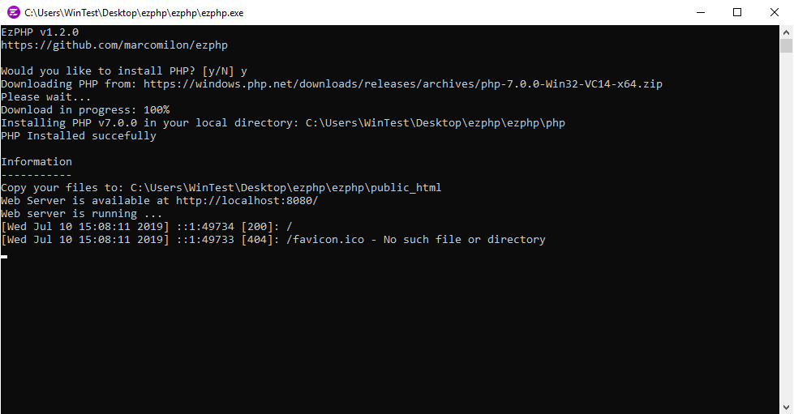

EzPHP gives you a personal PHP webserver for development. 

The goal of the project is to provide a single .exe file that will get you a ready to use PHP development environment.



### Installation

1. Download [ezphp.zip](https://github.com/marcomilon/ezphp/releases/download/1.2.0/ezphp.zip).
2. Create a new folder for your project and copy ezphp.exe.
3. Run ezphp.exe. If PHP is not installed locally ezphp will try to download and install PHP.
4. Open your browser in http://localhost:8080. 

Advanced user execute `ezphp.exe -h` to view all options.

```
Usage of ./ezphp:
  -S string
        <addr>:<port> - Run with built-in web server. (default "localhost:8080")
  -t string
        <docroot> - Specify document root <docroot> for built-in web server. (default "public_html")
```

### How it works?

After launching ezphp.exe you will get a PHP web server on port 8080. See Usage to change the port. 

To start working just copy your PHP files to the **Document root** folder and then open the url **http://localhost:8080** on your web browser.

### Why i created EzPHP?

XAMP or equivalent environments are difficult to set up for inexperienced users. 
EzPHP gives you have a PHP development environment with just one click.

**Note:** EzPHP is available only for windows.

### Requirements

PHP binaries required to have *Visual C++ Redistributable for Visual Studio 2017* installed on your computer.
In case you need it you can download it from https://www.microsoft.com/en-us/download/details.aspx?id=48145

### Contribution

EzPHP is open source. Feel free to contribute! Just create a new issue or a new pull request.

Thanks [mirzazulfan](https://github.com/mirzazulfan) for the logo

### License

This library is released under the MIT License.

